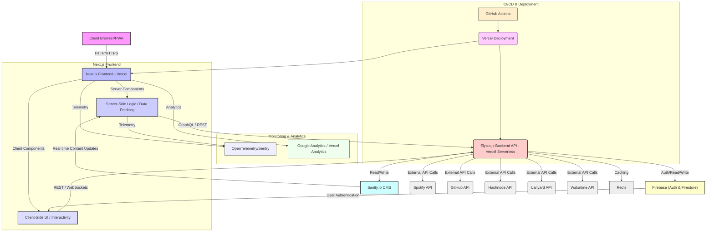

<!--
  Generated by AI-Powered README Generator
  Repository: https://github.com/WomB0ComB0/portfolio
  Generated: 2025-10-16T09:26:13.235Z
  Format: md
  Style: comprehensive
-->

# 🚀 Womb0ComB0 Portfolio: Your Digital Canvas
An interactive and high-performance developer portfolio showcasing projects, real-time insights, and a dynamic online presence.

[](https://github.com/WomB0ComB0/portfolio/actions/workflows/nextjs_bundle_analysis.yml)
[](https://github.com/WomB0ComB0/portfolio/actions/workflows/lint.yml)
[](https://github.com/WomB0ComB0/portfolio/actions/workflows/playwright.yml)
[](https://github.com/WomB0ComB0/portfolio/blob/main/LICENSE)
[](https://github.com/WomB0ComB0/portfolio/releases)
[](https://www.typescriptlang.org/)
[](https://nextjs.org/)
[](https://elysiajs.com/)

---

## 🗺️ Table of Contents

- [🚀 Womb0ComB0 Portfolio: Your Digital Canvas](#--womb0comb0-portfolio-your-digital-canvas)
- [🗺️ Table of Contents](#️-table-of-contents)
- [✨ Overview & Introduction](#-overview--introduction)
  - [What is this Application?](#what-is-this-application)
  - [Purpose & Goals](#purpose--goals)
  - [Target Audience](#target-audience)
- [🌟 Feature Highlights](#-feature-highlights)
- [🏛️ Architecture & Design](#️-architecture--design)
  - [High-Level Component Diagram](#high-level-component-diagram)
  - [Core Components & Responsibilities](#core-components--responsibilities)
  - [Technology Stack](#technology-stack)
- [🛠️ Getting Started](#️-getting-started)
  - [Prerequisites](#prerequisites)
  - [Installation Steps](#installation-steps)
  - [Configuration](#configuration)
    - [Environment Variables (`.env`)](#environment-variables-env)
    - [Sanity.io Setup](#sanityio-setup)
    - [Firebase Setup](#firebase-setup)
  - [Running the Application](#running-the-application)
    - [Development Mode](#development-mode)
    - [Production Build & Run](#production-build--run)
    - [Running with Docker](#running-with-docker)
- [💡 Usage & Workflows](#-usage--workflows)
  - [Navigating the Portfolio](#navigating-the-portfolio)
  - [Command Palette (KBar)](#command-palette-kbar)
  - [Interacting with the Guestbook](#interacting-with-the-guestbook)
  - [Viewing Dynamic Content](#viewing-dynamic-content)
  - [Common CLI Commands](#common-cli-commands)
- [⚠️ Limitations, Known Issues & Future Roadmap](#️-limitations-known-issues--future-roadmap)
  - [Current Limitations](#current-limitations)
  - [Known Issues](#known-issues)
  - [Future Roadmap](#future-roadmap)
- [🤝 Contributing & Development Guidelines](#-contributing--development-guidelines)
  - [How to Contribute](#how-to-contribute)
  - [Branching & Pull Request Guidelines](#branching--pull-request-guidelines)
  - [Code Style & Linting](#code-style--linting)
  - [Testing](#testing)
  - [Development Setup](#development-setup)
- [📜 License, Credits & Contact](#-license-credits--contact)
  - [License](#license)
  - [Acknowledgments](#acknowledgments)
  - [Contact](#contact)
- [📚 Appendix](#-appendix)
  - [Changelog](#changelog)
  - [FAQ (Frequently Asked Questions)](#faq-frequently-asked-questions)
  - [Troubleshooting Guide](#troubleshooting-guide)
  - [API Reference](#api-reference)

---

## ✨ Overview & Introduction <a name="overview"></a>
[[⬆️ Back to Top](#️-table-of-contents)]

### What is this Application?
This project is a sophisticated, interactive personal portfolio application built with Next.js (App Router), TypeScript, and a robust API backend powered by Elysia.js. It serves as a central hub for displaying a developer's profile, skills, resume, blog posts, projects, and various real-time statistics (e.g., Spotify activity, coding insights from Wakatime, GitHub stats, Discord presence via Lanyard). The application is designed to be highly dynamic, engaging, and performant.

### Purpose & Goals
The primary goals of this application are:
*   **Showcase Expertise:** Present a comprehensive and visually appealing overview of the developer's professional journey, skills, and projects.
*   **Dynamic Engagement:** Provide interactive elements such as a guestbook, real-time data visualizations, and an intuitive command palette to enhance user experience.
*   **Technical Proficiency:** Demonstrate advanced modern web development practices, including server-side rendering, API integrations, robust error handling, security measures, and PWA capabilities.
*   **Centralized Presence:** Consolidate disparate online activities (blog, social media, coding stats) into a single, cohesive platform.

### Target Audience
*   **Recruiters & Hiring Managers:** To quickly assess skills, experience, and project quality.
*   **Potential Collaborators:** To find synergy for joint projects or initiatives.
*   **Fellow Developers:** To inspire, share knowledge, and explore technical implementations.
*   **General Visitors:** Anyone interested in the developer's work, thoughts, or online presence.

---

## 🌟 Feature Highlights <a name="features"></a>
[[⬆️ Back to Top](#️-table-of-contents)]

This portfolio is packed with features designed to provide a rich and informative user experience:

*   **⚡ Blazing Fast Performance:** Leverages Next.js App Router for optimal server-side rendering (SSR), static site generation (SSG), and client-side navigation.
*   **🎨 Modern & Responsive UI:** Built with [Tailwind CSS](https://tailwindcss.com/), [shadcn/ui](https://ui.shadcn.com/), and custom [MagicUI](https://magicui.design/) components for a beautiful, adaptive design.
*   **📝 Dynamic Content Management:**
    *   **Sanity.io CMS Integration:** Effortlessly manage projects, experiences, certifications, and other content via a headless CMS.
    *   **Hashnode Blog Integration:** Fetches and displays blog posts directly from a Hashnode blog.
*   **📊 Real-time Data & Insights:**
    *   **Spotify Now Playing:** Displays current Spotify listening activity.
    *   **Top Artists/Tracks:** Showcases frequently listened-to music.
    *   **GitHub Statistics:** Displays profile stats and dynamically loaded pinned repositories.
    *   **Wakatime Coding Stats:** Integrates with Wakatime to visualize coding activity.
    *   **Discord Presence (Lanyard):** Shows current Discord status and activity.
*   **🗣️ Interactive Guestbook:** Users can sign in (via Firebase Auth) to leave messages, fostering community engagement.
*   **🔍 Command Palette (KBar):** A powerful `cmd+k` interface for quick navigation and actions throughout the site.
*   **🌗 Theme Switching:** Seamless dark and light mode toggle for personalized viewing.
*   **🛡️ Robust Security:**
    *   **CSRF Protection:** Protects against cross-site request forgery.
    *   **Rate Limiting:** Prevents abuse and ensures API stability.
    *   **IP Banlist:** Blocks malicious IP addresses.
*   **☁️ Edge-Optimized APIs:** A dedicated backend built with [Elysia.js](https://elysiajs.com/) for high-performance API routes.
*   **🌐 SEO & PWA Ready:**
    *   **Dynamic Sitemap & Robots.txt:** Generated automatically for optimal search engine indexing.
    *   **Progressive Web App (PWA):** Installable for a native app-like experience.
    *   **Open Graph (OG) Images:** Dynamically generated social media preview images.
*   **🐛 Comprehensive Error Handling:** Custom error pages (401, 403, 404, 500, 503) and global error boundaries for a resilient user experience.
*   **📈 Observability:** Integrated with OpenTelemetry and Sentry for monitoring and debugging.
*   **🧑‍💻 Local Development Experience:** Dockerized setup for consistent development and deployment.

---

## 🏛️ Architecture & Design <a name="architecture"></a>
[[⬆️ Back to Top](#️-table-of-contents)]

The Womb0ComB0 Portfolio is designed as a modern, full-stack application leveraging serverless functions, a headless CMS, and multiple third-party API integrations.

### High-Level Component Diagram
Here's a high-level overview of the application's architecture, illustrating the primary components and their interactions:



### Core Components & Responsibilities

1.  **Next.js Frontend (Vercel)**:
    *   **Server Components (`src/app/**/page.tsx`, `layout.tsx`):** Handle data fetching, SEO metadata generation, and initial page rendering on the server for performance and searchability. They act as orchestration layers, fetching data from the Elysia.js API or Sanity.
    *   **Client Components (`'use client'`):** Provide interactivity (e.g., guestbook input, theme toggles, animations), manage client-side state, and handle user events.
    *   **App Router:** Organizes routing, layouts, and data fetching in a modern React paradigm.
    *   **Providers (`src/providers`):** Centralized React Context providers for themes, data fetching (TanStack Query), global state (Jotai, Zustand), and other services.

2.  **Elysia.js Backend API (Vercel Serverless)**:
    *   Located at `src/app/api/[[...route]]/elysia.ts` and `src/app/api/v1/[[...route]]/elysia.ts`.
    *   A lightweight, high-performance API layer built with [Elysia.js](https://elysiajs.com/), a Bun-based framework.
    *   **API Gateway:** Aggregates data from various external APIs (Spotify, GitHub, Hashnode, Lanyard, Wakatime) and serves it to the Next.js frontend.
    *   **Custom Logic:** Handles operations like guestbook message submission, security middleware (CSRF, Rate Limiting, IP bans), and data transformation.
    *   **Caching (`src/classes/redis.ts`, `src/classes/swr-cache.ts`):** Implements server-side caching using Redis to reduce API calls and improve response times for frequently requested data.

3.  **Sanity.io CMS**:
    *   A headless content management system used for structured content like projects, work experiences, and certifications.
    *   The Next.js frontend fetches data from Sanity via the Elysia.js API or directly using Sanity client in server components.
    *   Provides a dedicated studio for content editors (`sanity.config.ts`).

4.  **Firebase (Authentication & Firestore)**:
    *   **Firebase Authentication:** Powers user login (e.g., Google, GitHub) for interactive features like the guestbook.
    *   **Firestore Database:** Stores dynamic user-generated content, such as guestbook messages. Real-time updates are handled using Jotai atoms.

5.  **External APIs**:
    *   **Spotify:** Fetches "Now Playing" status, top artists, and top tracks.
    *   **GitHub:** Retrieves pinned repositories and profile statistics.
    *   **Hashnode:** Integrates with a personal blog to display recent posts.
    *   **Lanyard:** Connects to Discord to show real-time user activity and status.
    *   **Wakatime:** Provides coding activity metrics and statistics.

6.  **Monitoring & Analytics**:
    *   **OpenTelemetry & Sentry:** For distributed tracing, error reporting, and performance monitoring across the application.
    *   **Google Analytics / Vercel Analytics:** For user behavior tracking and site performance metrics.

### Technology Stack <a name="tech-stack"></a>
*   **Frontend:**
    *   **Framework:** Next.js (App Router)
    *   **Language:** TypeScript
    *   **UI Library:** React
    *   **Styling:** Tailwind CSS
    *   **UI Components:** shadcn/ui, MagicUI
    *   **State Management:** Jotai (for global state), Zustand (for simple client-side persistence), TanStack Query (for server state/caching)
    *   **Animations:** Framer Motion
    *   **Command Palette:** KBar
    *   **Real-time:** Liveblocks (for cursor presence/collaboration, if enabled)
*   **Backend API:**
    *   **Framework:** Elysia.js (built on Bun)
    *   **Language:** TypeScript
    *   **Validation:** Zod
*   **CMS:** Sanity.io
*   **Database:** Google Firestore (via Firebase)
*   **Authentication:** Firebase Auth
*   **Caching:** Redis
*   **Deployment:** Vercel (Frontend & Elysia API as serverless functions)
*   **Containerization:** Docker, Docker Compose
*   **Testing:** Playwright (E2E), Vitest (Unit/Integration)
*   **Code Quality:** Biome, Stylelint
*   **Monitoring:** OpenTelemetry, Sentry
*   **Build Tool:** Bun

---

## 🛠️ Getting Started <a name="getting-started"></a>
[[⬆️ Back to Top](#️-table-of-contents)]

Follow these steps to get a local copy of the project up and running for development and testing purposes.

### Prerequisites <a name="prerequisites"></a>
Ensure you have the following installed on your machine:
*   **Git:** For cloning the repository.
*   **Bun** (recommended) or **Node.js** (v18.x or higher) with **npm/yarn**:
    ```bash
    # Install Bun (preferred)
    curl -fsSL https://bun.sh/install | bash
    ```
*   **Docker** & **Docker Compose**: For running the application with containerization and Redis.
    *   [Install Docker Desktop](https://www.docker.com/products/docker-desktop/)
*   **Cloud Accounts:**
    *   [Sanity.io](https://www.sanity.io/) account for CMS.
    *   [Firebase](https://firebase.google.com/) project for Authentication and Firestore.
    *   API keys for [Spotify](https://developer.spotify.com/), [GitHub](https://docs.github.com/en/rest), [Hashnode](https://hashnode.com/api), [Discord (Lanyard)](https://lanyard.cnrad.dev/), [Wakatime](https://wakatime.com/developers).

### Installation Steps <a name="installation"></a>

1.  **Clone the repository:**
    ```bash
    git clone https://github.com/WomB0ComB0/portfolio.git
    cd portfolio
    ```

2.  **Install dependencies:**
    Using Bun (recommended):
    ```bash
    bun install
    ```
    Or using npm:
    ```bash
    npm install
    ```

3.  **Start Docker services (Redis):**
    This project uses Redis for caching. You can start a local Redis instance using Docker Compose:
    ```bash
    docker-compose up -d redis
    ```
    This command will start the Redis container in detached mode.

### Configuration <a name="configuration"></a>

#### Environment Variables (`.env`) <a name="env-vars"></a>
Copy the example environment file and fill in your details:
```bash
cp .env.example .env
```
Open the newly created `.env` file and populate the variables. Many APIs require specific credentials (client IDs, secrets, tokens).

<details>
<summary>💡 Expand to see a list of critical environment variables and their purpose:</summary>

```ini
# --- Core Application Settings ---
NEXT_PUBLIC_APP_URL="http://localhost:3000" # Your application's public URL
NEXT_PUBLIC_ANALYTICS_ID="" # Google Analytics Tracking ID (G-XXXXXXX)
VERCEL_GIT_COMMIT_SHA="" # Used for Vercel deployment (handled automatically)
NEXT_PUBLIC_GA_MEASUREMENT_ID="" # Google Analytics Measurement ID
NEXT_PUBLIC_GTM_CONTAINER_ID="" # Google Tag Manager Container ID

# --- Sanity.io CMS ---
NEXT_PUBLIC_SANITY_PROJECT_ID="" # Your Sanity Project ID
NEXT_PUBLIC_SANITY_DATASET=""     # Your Sanity Dataset (e.g., "production" or "development")
NEXT_PUBLIC_SANITY_API_VERSION="2024-05-15" # Sanity API version
SANITY_API_READ_TOKEN=""          # Sanity token for reading draft/private content (if applicable)

# --- Firebase ---
NEXT_PUBLIC_FIREBASE_API_KEY=""
NEXT_PUBLIC_FIREBASE_AUTH_DOMAIN=""
NEXT_PUBLIC_FIREBASE_PROJECT_ID=""
NEXT_PUBLIC_FIREBASE_STORAGE_BUCKET=""
NEXT_PUBLIC_FIREBASE_MESSAGING_SENDER_ID=""
NEXT_PUBLIC_FIREBASE_APP_ID=""
NEXT_PUBLIC_FIREBASE_MEASUREMENT_ID=""

# --- Spotify API ---
SPOTIFY_CLIENT_ID=""
SPOTIFY_CLIENT_SECRET=""
SPOTIFY_REFRESH_TOKEN="" # See Spotify API docs for generating this.

# --- GitHub API ---
GITHUB_TOKEN="" # Personal Access Token with repo scope

# --- Hashnode API (Blog) ---
HASHNODE_USER_ID="" # Your Hashnode user ID

# --- Discord Lanyard API ---
LANYARD_USER_ID="" # Your Discord User ID

# --- Wakatime API ---
WAKATIME_API_KEY="" # Your Wakatime API Key

# --- Redis Caching ---
REDIS_URL="redis://localhost:6379" # Default for local Docker setup

# --- Security ---
NEXT_PUBLIC_ALLOWED_IP="" # Comma-separated list of IPs allowed for specific routes
ALLOWED_GEO_COUNTRY=""    # Comma-separated list of countries (ISO 3166-1 alpha-2 codes)

# --- Sentry (Optional for error tracking) ---
SENTRY_AUTH_TOKEN=""
SENTRY_DSN=""
NEXT_PUBLIC_SENTRY_DSN=""

# --- Liveblocks (Optional for real-time collaboration features like cursors) ---
LIVEBLOCKS_SECRET_KEY=""
NEXT_PUBLIC_LIVEBLOCKS_PUBLIC_KEY=""

# --- Other (e.g., Vercel KV for edge caching) ---
KV_URL=""
KV_REST_API_URL=""
KV_REST_API_TOKEN=""
KV_REST_API_READ_ONLY_TOKEN=""
```
</details>

#### Sanity.io Setup <a name="sanity-setup"></a>
1.  **Initialize Sanity Project:** If you don't have one, create a Sanity project from your Sanity dashboard.
2.  **Schema Deployment:** The Sanity schemas are defined in `src/sanity/schemaTypes`. You might need to deploy these to your Sanity project.
    ```bash
    bun run sanity deploy
    # or npm run sanity deploy
    ```
    Follow the prompts to connect to your Sanity project.
3.  **Content Population:** Use the Sanity Studio (accessible locally after running `bun run sanity start` or `npm run sanity start`) to add your projects, experiences, and certifications.

#### Firebase Setup <a name="firebase-setup"></a>
1.  **Create a Firebase Project:** Go to the [Firebase Console](https://console.firebase.google.com/) and create a new project.
2.  **Enable Authentication:** In your Firebase project, enable at least one authentication provider (e.g., Google Sign-in) for the Guestbook feature.
3.  **Enable Firestore Database:** Create a Cloud Firestore database. The Guestbook feature uses a collection (e.g., `messages`) to store entries.
4.  **Get Firebase Config:** In your Firebase project settings, find your web app's configuration (API Key, Auth Domain, etc.) and populate the corresponding `NEXT_PUBLIC_FIREBASE_...` variables in your `.env` file.

### Running the Application <a name="running-app"></a>

#### Development Mode <a name="dev-mode"></a>
To run the application locally with hot-reloading:
```bash
bun dev
# or npm run dev
```
The application will be accessible at `http://localhost:3000`.

#### Production Build & Run <a name="prod-run"></a>
To build the application for production and serve it:
1.  **Build:**
    ```bash
    bun build
    # or npm run build
    ```
2.  **Start:**
    ```bash
    bun start
    # or npm run start
    ```
    The application will be accessible at `http://localhost:3000`.

#### Running with Docker <a name="docker-run"></a>
For a containerized environment (recommended for consistent production-like setup locally):
1.  Ensure you have your `.env` file populated.
2.  Build and run the Docker containers:
    ```bash
    docker-compose up --build -d
    ```
    This will build the Docker image for the Next.js app, start it, and ensure Redis is also running.
3.  Access the application at `http://localhost:3000`.
4.  To stop the containers:
    ```bash
    docker-compose down
    ```

---

## 💡 Usage & Workflows <a name="usage"></a>
[[⬆️ Back to Top](#️-table-of-contents)]

This section guides you through the main ways to interact with the Womb0ComB0 Portfolio.

### Navigating the Portfolio <a name="navigation"></a>
The primary navigation is available via the top menu bar (desktop) or a mobile-friendly drawer.
Common sections include:
*   **Home (`/`):** An introduction and overview of pinned projects.
*   **Projects (`/projects`):** Detailed listings of personal and professional projects, often linked to GitHub or external sites.
*   **Experience (`/experience`):** A timeline of work history and roles.
*   **Blog (`/blog`):** A collection of articles and insights.
*   **Certifications (`/certifications`):** Displays earned professional certifications.
*   **Guestbook (`/guestbook`):** An interactive page where visitors can leave messages.
*   **Spotify (`/spotify`):** Shows real-time Spotify activity and listening habits.
*   **Stats (`/stats`):** A dashboard for various coding and online presence statistics.

### Command Palette (KBar) <a name="kbar"></a>
A central feature for quick access to actions and navigation.
*   **Activate:** Press <kbd>Cmd + K</kbd> (Mac) or <kbd>Ctrl + K</kbd> (Windows/Linux) anywhere on the site.
*   **Usage:** Type commands like "go to projects", "toggle theme", "contact", or directly navigate to a page.

### Interacting with the Guestbook <a name="guestbook"></a>
1.  **Access:** Navigate to the `/guestbook` page.
2.  **Sign In:** You'll be prompted to sign in using your Google or GitHub account (via Firebase Authentication).
3.  **Leave a Message:** Once signed in, a text area will appear, allowing you to type and submit your message.
4.  **View Messages:** All public messages left by other users will be displayed on the page.

<p align="center">
    
    <br/>
    <em>Example of the interactive Guestbook.</em>
</p>

### Viewing Dynamic Content <a name="dynamic-content"></a>
Many sections of the portfolio display real-time or frequently updated data:
*   **Spotify:** Visit `/spotify` to see what's currently playing, or recent top tracks and artists. This data is fetched via the Elysia.js API.
*   **Projects:** The `/projects` page pulls project data from Sanity.io and potentially GitHub. Clicking on a project typically leads to a detail page with more information.
*   **Blog:** The `/blog` page fetches the latest posts from Hashnode through the Elysia.js API.
*   **Stats:** The `/stats` page combines data from Lanyard (Discord), GitHub, and Wakatime to offer a comprehensive look at online activity.

### Common CLI Commands <a name="cli-commands"></a>
The `package.json` defines several useful scripts for development, testing, and maintenance:

<details>
<summary>💻 Expand to see common CLI commands:</summary>

```bash
# --- Development & Build ---

# Start the development server
bun dev

# Build the application for production
bun build

# Start the production server after building
bun start

# --- Linting & Formatting ---

# Lint all TypeScript/JavaScript files using Biome
bun lint

# Fix linting issues automatically
bun lint:fix

# Format all files using Biome
bun format

# Format and fix all files
bun format:fix

# --- Testing ---

# Run unit and integration tests with Vitest
bun test

# Run Vitest in watch mode
bun test:watch

# Run end-to-end tests with Playwright
bun test:e2e

# Open Playwright UI for debugging E2E tests
bun test:e2e:ui

# --- Utility & Sanity CMS ---

# Check for security vulnerabilities in dependencies
bun audit

# Start the Sanity CMS Studio locally
bun sanity start

# Deploy Sanity schemas (after making changes)
bun sanity deploy

# Generate GraphQL types (if using GraphQL, check `codegen.yml`)
bun generate

# Run a custom script (e.g., for reporting bundle size)
bun report-bundle-size

# Remove duplicate packages from bun.lockb or package-lock.json
bun remove-duplicate-packages
```
</details>

---

## ⚠️ Limitations, Known Issues & Future Roadmap <a name="limitations"></a>
[[⬆️ Back to Top](#️-table-of-contents)]

### Current Limitations <a name="current-limitations"></a>
*   **External API Dependencies:** Heavy reliance on external APIs means downtime or rate limits from providers (Spotify, GitHub, etc.) can affect certain features. Caching is implemented to mitigate this but isn't foolproof.
*   **Cold Start:** Serverless functions for the Elysia.js API might experience cold starts, leading to slight delays on the first request after a period of inactivity.
*   **Complex Setup:** The multi-service architecture (Next.js, Elysia, Sanity, Firebase, Redis) can make the initial setup slightly complex for new contributors.
*   **Effect Integration:** The use of the `Effect` functional programming library in the API might have a steeper learning curve for developers unfamiliar with it.

### Known Issues <a name="known-issues"></a>
*   **Sporadic API Rate Limits:** Occasionally, intensive usage or rapid refreshes might hit rate limits on third-party APIs (especially GitHub), causing temporary data unavailability.
*   **Sanity Content Sync Delay:** Changes made in Sanity Studio might take a few seconds to reflect on the live site due to caching mechanisms.
*   **Liveblocks Issues:** (If enabled) Real-time cursor presence might occasionally disconnect in unstable network conditions.

### Future Roadmap <a name="roadmap"></a>
The project is continuously evolving. Here are some planned enhancements:
*   **Enhanced Interactivity:** More real-time components using Liveblocks or WebSockets, like collaborative editing for certain content sections (if applicable).
*   **Additional API Integrations:** Explore integrating with more services (e.g., Stack Overflow, LinkedIn activity feed).
*   **Improved Caching Strategies:** Implement more advanced edge caching with Vercel KV for global performance.
*   **Full Internationalization (i18n):** Support for multiple languages to broaden the audience.
*   **Refined UI/UX:** Continuous improvements to design, accessibility, and user flow based on feedback and analytics.
*   **Stripe Integration:** For potential e-commerce functionalities (e.g., "Hire Me" services, digital product sales).
*   **Comprehensive Analytics Dashboard:** A dedicated, password-protected page to view site analytics.
*   **Automated Content Updates:** Explore webhooks or cron jobs to trigger content updates from external sources (e.g., a new Hashnode post automatically appearing).

---

## 🤝 Contributing & Development Guidelines <a name="contributing"></a>
[[⬆️ Back to Top](#️-table-of-contents)]

We welcome contributions of all kinds! Whether it's reporting bugs, suggesting features, or submitting code, your help is appreciated.

### How to Contribute <a name="how-to-contribute"></a>
1.  **Fork the repository:** Start by forking the `WomB0ComB0/portfolio` repository to your GitHub account.
2.  **Clone your fork:**
    ```bash
    git clone https://github.com/YOUR_USERNAME/portfolio.git
    cd portfolio
    ```
3.  **Create a new branch:** Choose a descriptive name for your branch.
    ```bash
    git checkout -b feature/your-feature-name
    # or bugfix/issue-description
    ```
4.  **Make your changes:** Implement your feature or fix.
5.  **Test your changes:** Run unit, integration, and E2E tests to ensure everything works as expected.
    ```bash
    bun test
    bun test:e2e
    ```
6.  **Commit your changes:** Use conventional commit messages.
    ```bash
    git commit -m "feat: add amazing new feature"
    ```
7.  **Push to your fork:**
    ```bash
    git push origin feature/your-feature-name
    ```
8.  **Open a Pull Request (PR):**
    *   Go to the original `WomB0ComB0/portfolio` repository on GitHub.
    *   Click on the "New Pull Request" button.
    *   Ensure the base branch is `main` and your compare branch is your feature branch.
    *   Provide a clear title and detailed description of your changes, referencing any relevant issues.

### Branching & Pull Request Guidelines <a name="pr-guidelines"></a>
*   **Branch Naming:** Use `feature/`, `bugfix/`, `chore/`, `docs/`, or `refactor/` prefixes (e.g., `feature/add-dark-mode`, `bugfix/fix-guestbook-auth`).
*   **Commit Messages:** Follow [Conventional Commits](https://www.conventionalcommits.org/en/v1.0.0/) for clear and descriptive commit history.
*   **Pull Request Description:**
    *   Clearly describe the problem solved or the feature implemented.
    *   Explain your approach and any significant design decisions.
    *   Provide steps to test your changes.
    *   Reference related issues (e.g., `Closes #123`, `Fixes #456`).
*   **Code Review:** All PRs require at least one approval before merging.

### Code Style & Linting <a name="code-style"></a>
This project enforces consistent code style and quality using:
*   **Biome:** For formatting and linting (`biome.json`).
*   **Stylelint:** For CSS/Tailwind-related linting (`.stylelintrc.json`).

Before submitting a PR, ensure your code adheres to the style guidelines by running:
```bash
bun format:fix
bun lint:fix
```

### Testing <a name="testing"></a>
*   **Unit/Integration Tests (Vitest):** Located in `src/__tests__/` and other relevant feature directories.
*   **End-to-End Tests (Playwright):** Located in `src/e2e/`.

Run all tests locally before submitting a PR:
```bash
bun test
bun test:e2e --project=chromium # Run E2E tests specifically for Chromium
```

### Development Setup <a name="dev-setup"></a>
*   **VS Code:** Recommended editor. Install extensions for TypeScript, Tailwind CSS, Biome, and Playwright for a smoother experience.
*   **Bun:** Preferred package manager and runtime.
*   **Docker:** Essential for running local Redis and replicating the production environment.

---

## 📜 License, Credits & Contact <a name="license-credits"></a>
[[⬆️ Back to Top](#️-table-of-contents)]

### License <a name="license"></a>
This project is licensed under the **MIT License**.
You are free to use, modify, and distribute this software, provided you include the original copyright and license notice. See the [LICENSE](LICENSE) file for more details.

### Acknowledgments <a name="acknowledgments"></a>
This project stands on the shoulders of giants. Special thanks to the creators and maintainers of the following open-source projects and services:
*   [Next.js](https://nextjs.org/) & [React](https://react.dev/)
*   [TypeScript](https://www.typescriptlang.org/)
*   [Tailwind CSS](https://tailwindcss.com/)
*   [shadcn/ui](https://ui.shadcn.com/)
*   [MagicUI](https://magicui.design/)
*   [Elysia.js](https://elysiajs.com/) & [Bun](https://bun.sh/)
*   [Sanity.io](https://www.sanity.io/)
*   [Firebase](https://firebase.google.com/)
*   [Liveblocks](https://liveblocks.io/)
*   [KBar](https://kbar.vercel.app/)
*   [Jotai](https://jotai.org/) & [Zustand](https://zustand-demo.pmnd.rs/)
*   [TanStack Query](https://tanstack.com/query)
*   [Vitest](https://vitest.dev/) & [Playwright](https://playwright.dev/)
*   [Biome](https://biomejs.dev/)
*   [Vercel](https://vercel.com/) for hosting and serverless functions.
*   All the amazing developers whose open-source work inspired and facilitated this project.

### Contact <a name="contact"></a>
This project is maintained by **Mike Odnis**.

*   **GitHub:** [@WomB0ComB0](https://github.com/WomB0ComB0)
*   **Website:** [https://womb0comb0.me/](https://womb0comb0.me/) (once deployed)
*   **Email:** [mike@odnis.com](mailto:mike@odnis.com) (example, adjust if needed)

Feel free to reach out with any questions, feedback, or collaboration opportunities!

---

## 📚 Appendix <a name="appendix"></a>
[[⬆️ Back to Top](#️-table-of-contents)]

### Changelog <a name="changelog"></a>
For detailed release notes and changes, please refer to the [releases page](https://github.com/WomB0ComB0/portfolio/releases) or the `CHANGELOG.md` file (if available in the future).

**Recent Updates:**
*   **Initial Public Release (v1.0.0):** Established core portfolio features, multi-API integrations, Sanity CMS, and Elysia.js backend.
*   **Performance Optimizations:** Implemented Redis caching, `Effect` pattern in API, and Next.js App Router best practices.
*   **Security Enhancements:** Added CSRF, rate limiting, and IP banlist middleware.
*   **Comprehensive Testing:** Integrated Vitest for unit/integration tests and Playwright for E2E testing.
*   **Improved Developer Experience:** Docker setup, Biome/Stylelint for code quality, and detailed documentation.

### FAQ (Frequently Asked Questions) <a name="faq"></a>

<details>
<summary>Q: How do I update the content on my portfolio?</summary>
A: Content like projects, experiences, and certifications are managed through <a href="#sanity-setup">Sanity.io CMS</a>. After setting up your Sanity project, you can access the Sanity Studio (usually at `/studio` on your domain or locally via `bun run sanity start`) to make edits. Blog posts are managed directly on your Hashnode account.
</details>

<details>
<summary>Q: Can I use this template for my own portfolio?</summary>
A: Yes! This project is open-source under the <a href="#license">MIT License</a>. You are encouraged to fork it, adapt it, and make it your own. Remember to update the `.env` variables with your personal API keys and content sources.
</details>

<details>
<summary>Q: How do I deploy this application?</summary>
A: The recommended deployment platform is <a href="https://vercel.com/">Vercel</a>, as the project is optimized for it (Next.js, serverless functions). You can link your GitHub repository to Vercel, and it will automatically build and deploy your application on every push to the `main` branch. Ensure all <a href="#env-vars">environment variables</a> are configured in your Vercel project settings.
</details>

<details>
<summary>Q: What if a specific feature (e.g., Spotify Now Playing) isn't working?</summary>
A:
1.  **Check `.env`:** Double-check that all relevant environment variables (e.g., `SPOTIFY_CLIENT_ID`, `SPOTIFY_CLIENT_SECRET`, `SPOTIFY_REFRESH_TOKEN`) are correctly configured and valid.
2.  **API Status:** Verify that the third-party API (e.g., Spotify API) is operational and not experiencing downtime.
3.  **Logs:** Check your local server logs (in development mode) or Vercel deployment logs for any error messages related to API calls.
4.  **Rate Limits:** You might have hit a rate limit. Wait a few minutes and try again.
</details>

### Troubleshooting Guide <a name="troubleshooting"></a>

<details>
<summary>❌ "Error: missing environment variables"</summary>
**Cause:** The application failed to start because one or more critical environment variables are not set in your `.env` file or deployment environment.
**Solution:** Refer to the <a href="#env-vars">Configuration section</a> and ensure all required variables are present and correctly populated. If deploying to Vercel, ensure these are added as environment variables in your Vercel project settings.
</details>

<details>
<summary>❌ "API Call Failed" or "Data Not Loading"</summary>
**Cause:** This could be due to incorrect API keys, expired tokens, network issues, or a third-party API being down.
**Solution:**
1.  **Verify API Keys/Tokens:** Double-check all `_KEY`, `_ID`, `_SECRET`, and `_TOKEN` variables in your `.env` for correctness. For refresh tokens (e.g., Spotify), ensure they are still valid.
2.  **Check Network:** Confirm your internet connection is stable.
3.  **Inspect Logs:** Look at the server console (local `bun dev`) or Vercel logs for specific error messages from the Elysia.js API or external services.
4.  **Test External APIs:** You can sometimes test external API endpoints directly using tools like Postman or `curl` to isolate the issue.
</details>

<details>
<summary>❌ "Sanity Studio Not Loading" or "Sanity Content Not Appearing"</summary>
**Cause:** Issues with Sanity project configuration, network, or schema deployment.
**Solution:**
1.  **Check Sanity `.env`:** Ensure `NEXT_PUBLIC_SANITY_PROJECT_ID`, `NEXT_PUBLIC_SANITY_DATASET`, and `SANITY_API_READ_TOKEN` are correct.
2.  **Run Sanity Studio Locally:** Try `bun run sanity start` in your project root to see if the studio itself can connect.
3.  **Deploy Schemas:** If you've made changes to `src/sanity/schemaTypes/` or if it's a new setup, ensure you've deployed your schemas using `bun run sanity deploy`.
</details>

<details>
<summary>❌ "Guestbook Authentication Not Working"</summary>
**Cause:** Incorrect Firebase configuration or issues with Firebase project setup.
**Solution:**
1.  **Firebase `.env`:** Confirm all `NEXT_PUBLIC_FIREBASE_...` variables are accurately copied from your Firebase project settings.
2.  **Firebase Console:**
    *   Ensure **Firebase Authentication** is enabled in your Firebase project.
    *   Verify that the specific sign-in providers (e.g., Google, GitHub) you intend to use are **enabled** in the Firebase Authentication settings.
    *   Check your **Firestore Database** rules to ensure your application has permission to read and write messages.
</details>

### API Reference <a name="api-reference"></a>
The application exposes several API endpoints via the Elysia.js backend. These are primarily for internal use by the Next.js frontend, but can be explored for custom integrations.

The main API routes are located under:
*   `/api/[[...route]]`: For general-purpose API routes.
*   `/api/v1/[[...route]]`: For versioned API endpoints.

**Key Endpoints (Examples):**
*   `/api/v1/blog`: Fetches blog posts from Hashnode.
*   `/api/v1/github-stats`: Retrieves GitHub user statistics.
*   `/api/v1/lanyard`: Gets Discord presence data.
*   `/api/v1/messages`: Handles guestbook messages (read/write, requires authentication for write).
*   `/api/v1/now-playing`: Fetches current Spotify song.
*   `/api/v1/top-artists`: Gets top Spotify artists.
*   `/api/v1/top-tracks`: Gets top Spotify tracks.
*   `/api/v1/wakatime`: Retrieves Wakatime coding activity.

For detailed schema and handler information, refer to the files within `src/app/api/` and `src/app/api/v1/`. Each endpoint typically has associated `handlers.ts` and `schema.ts` files.
