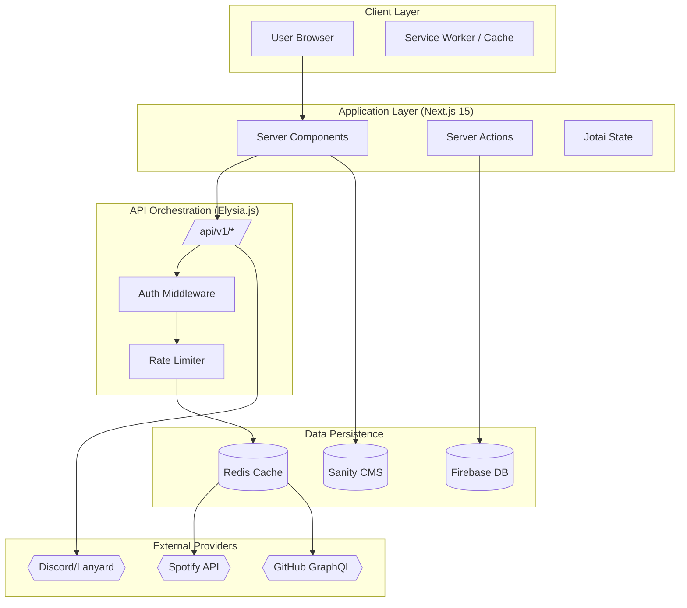
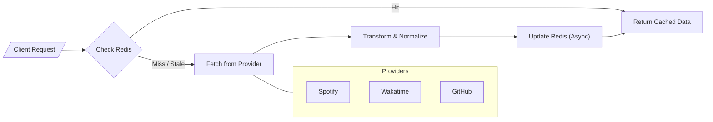

<!--
  Generated by AI-Powered README Generator
  Repository: https://github.com/WomB0ComB0/portfolio
  Generated: 2026-01-07T07:08:26.051Z
  Format: md
  Style: comprehensive
-->

# 🚀 WomB0ComB0 Portfolio

### A high-performance, real-time digital canvas showcasing technical mastery and developer identity.


## 🗺️ Table of Contents

- [Overview](#-overview)
- [Features](#-features)
- [Architecture](#-architecture)
- [Quick Start](#-quick-start)
- [Usage & Examples](#-usage--examples)
- [Configuration](#-configuration)
- [API Reference](#-api-reference)
- [Development](#-development)
- [Contributing](#-contributing)
- [Roadmap & Known Issues](#-roadmap--known-issues)
- [License & Credits](#-license--credits)

## 3. Overview

The WomB0ComB0 Portfolio is not just a static resume; it is a **Modular Monolith** designed for
real-time data orchestration and visual excellence. Built with **Next.js 15** and **Elysia.js**, it
aggregates a developer's digital footprint—from live coding sessions on Wakatime to real-time
Spotify playback—into a single, cohesive experience.

Most portfolios suffer from "stale data syndrome." This project solves that by implementing a hybrid
architecture: **Sanity.io** handles structured professional content (projects, experience) with
live-preview capabilities, while a dedicated **Elysia.js** API engine manages high-frequency
external data (GitHub, Discord, Spotify) via an intelligent **Redis** caching layer.

**Who is this for?**
- **Engineers** wanting a high-end boilerplate featuring the latest Next.js 15 patterns.
- **Hiring Managers** looking for verifiable, real-time evidence of a candidate's activity.
- **Open Source Contributors** interested in Type-safe API orchestration with Bun and Elysia.

## 4. Features

### 🎨 Frontend & Experience
- ✨ **Next.js 15 App Router:** Leveraging React Server Components (RSC) for zero-bundle-size logic.
- ⚡ **Command Palette (KBar):** Global navigation and quick actions via `Cmd+K`.
- 🌈 **Visual Mastery:** Integrated **MagicUI** components (BlurFade, BorderBeam) and custom
  shaders.
- 📱 **PWA Support:** Fully offline-capable with custom service workers and manifest.
- 🌓 **Adaptive Theming:** Deeply integrated dark/light modes with `next-themes`.

### ⚙️ Backend & API
- 🚀 **Elysia.js Engine:** Blazing fast API routes running alongside Next.js using Bun.
- 🧠 **Smart Caching:** Custom SWR (Stale-While-Revalidate) logic backed by Redis.
- 🛡️ **Security First:** Built-in rate limiting, CIDR-based banlists, and CSRF protection.
- 🤖 **n8n Automation:** Pre-configured workflows for content synchronization bots.

### 📊 Integrations
- 🎵 **Spotify:** Real-time "Now Playing" status and top track aggregation.
- 💬 **Lanyard:** Live Discord presence, activities, and status tracking.
- 🐙 **GitHub:** Dynamic repository pinning and contribution graphing via GraphQL.
- ✍️ **Guestbook:** Real-time messaging powered by Firebase and authenticated sessions.

## 5. Architecture

The system splits responsibilities between UI rendering (Next.js) and data orchestration (Elysia).

### System Architecture


### Data Flow (External API Aggregation)


### Tech Stack Table
| Layer | Technology | Purpose |
| :--- | :--- | :--- |
| **Runtime** | Bun | High-speed execution and package management. |
| **Framework** | Next.js 15 | UI, SSR, and React Server Components. |
| **API** | Elysia.js | Type-safe, high-performance API endpoints. |
| **CMS** | Sanity.io | Headless content management for projects/resume. |
| **Cache** | Redis | Stale-while-revalidate storage for external APIs. |
| **State** | Jotai | Atomic client-side state management. |

## 6. Quick Start

### Prerequisites
- **Bun:** ^1.1.0
- **Node.js:** ^20.0.0 (as fallback)
- **Docker:** (Optional, for Redis/Containerization)

### Installation

1. **Clone & Install**
   ```bash
   git clone https://github.com/WomB0ComB0/portfolio.git
   cd portfolio
   bun install
   ```

2. **Environment Configuration**
   ```bash
   cp .env.example .env.local
   ```
   *Edit `.env.local` and add your Sanity, GitHub, and Spotify credentials.*

3. **Development Server**
   ```bash
   bun dev
   ```

**Expected Output:**
- Frontend: `http://localhost:3000`
- API (Elysia): `http://localhost:3000/api/v1`
- Sanity Studio: `http://localhost:3000/studio` (if configured)

## 7. Usage & Examples

### Managing Content (Sanity)
Content like **Experience**, **Projects**, and **Certifications** is managed via the Sanity
Studio. This allows for live updates without triggering a redeploy.

```typescript
// Example: Fetching Projects with Sanity Live Content
import { sanityFetch } from "@/lib/sanity/live";
import { PROJECTS_QUERY } from "@/lib/sanity/queries";

const projects = await sanityFetch({ query: PROJECTS_QUERY });
```

### Real-time Status (Spotify)
The portfolio uses a custom hook to fetch the current track, which leverages the Elysia API
internally.

```tsx
import { useNowPlaying } from "@/hooks/use-spotify";

export function MusicStatus() {
  const { data, isLoading } = useNowPlaying();

  if (isLoading || !data?.isPlaying) return <div>Shhh... Silence is golden.</div>;

  return (
    <div>
      🎵 Now Playing: {data.title} by {data.artist}
    </div>
  );
}
```

<details>
<summary><b>Advanced: Adding a New Elysia Route</b></summary>

Routes are defined in `src/app/api/[[...route]]`. To add a new endpoint:
1. Create a directory under `v1/`.
2. Define a handler and a schema using `elysia`.
3. Export the module and register it in `elysia.ts`.

</details>

## 8. Configuration

### Environment Variables
| Variable | Required | Default | Description |
| :--- | :--- | :--- | :--- |
| `NEXT_PUBLIC_SANITY_PROJECT_ID` | Yes | - | Your Sanity.io project identifier. |
| `GITHUB_TOKEN` | Yes | - | Personal Access Token for GitHub GraphQL API. |
| `REDIS_URL` | No | - | Redis connection string (for caching). |
| `SPOTIFY_CLIENT_ID` | No | - | Spotify Developer Application ID. |
| `WAKATIME_API_KEY` | No | - | Key to fetch coding activity stats. |

### Configuration Files
- `next.config.ts`: Next.js optimization and header settings.
- `sanity.config.ts`: Schema definitions and Studio plugins.
- `biome.json`: Linting and formatting rules (replaces ESLint/Prettier).

## 9. API Reference

All endpoints are prefixed with `/api/v1/`.

### Endpoints

| Method | Path | Description | Params |
| :--- | :--- | :--- | :--- |
| `GET` | `/status/health` | Check API health and uptime. | None |
| `GET` | `/v1/now-playing` | Get real-time Spotify status. | None |
| `GET` | `/v1/github-stats` | Aggregated GitHub contributions. | `username` |
| `POST` | `/v1/messages` | Submit a Guestbook entry. | `message`, `user` |
| `GET` | `/v1/lanyard` | Fetch Discord presence info. | `id` |

**Example Response (`GET /v1/now-playing`):**
```json
{
  "isPlaying": true,
  "title": "Starboy",
  "artist": "The Weeknd",
  "albumImageUrl": "https://i.scdn.co/...",
  "songUrl": "https://open.spotify.com/track/..."
}
```

## 10. Development

### Project Structure
```text
src/
├── app/             # Next.js App Router (Pages & API)
│   └── api/         # Elysia.js Route Handlers
├── components/      # Shared UI Components (Shadcn + Custom)
├── hooks/           # Data fetching and UI hooks
├── lib/             # API Integrations (Spotify, GitHub, Sanity)
├── core/            # Firebase & Global Store configuration
└── utils/           # Formatting, Security, and Logging
```

### Tooling Commands
- **Linting:** `bun run lint`
- **Testing:** `bun run test` (Vitest)
- **E2E Testing:** `bun run test:e2e` (Playwright)
- **Type Check:** `bun run type-check`

## 11. Contributing

1. **Fork** the repository.
2. **Create a Feature Branch** (`git checkout -b feat/amazing-feature`).
3. **Commit Your Changes** (`git commit -m 'feat: add amazing feature'`).
4. **Push to the Branch** (`git push origin feat/amazing-feature`).
5. **Open a Pull Request**.

Please ensure your code follows the `biome.json` configuration and passes all tests.

## 12. Roadmap & Known Issues

### Planned Features
- [ ] **Blog Engine:** Fully integrated MDX/Sanity-based blog.
- [ ] **Sponsorship Page:** Direct integration with GitHub Sponsors.
- [ ] **Interactive 3D Stats:** Using Three.js/React Three Fiber for data visualization.
- [ ] **Internationalization:** Multi-language support (i18n).

### Known Limitations
- ⚠️ **Rate Limits:** Without a `REDIS_URL`, external API calls are made on every request, which
  may lead to 429 errors from GitHub/Spotify.
- ⚠️ **Cold Starts:** First-time Sanity fetches may experience slight latency in development
  environments.

## 13. License & Credits

- **License:** MIT License. See `LICENSE` for details.
- **Maintainer:** [WomB0ComB0](https://github.com/WomB0ComB0)
- **Special Thanks:**
  - [Next.js](https://nextjs.org/) for the incredible framework.
  - [Elysia.js](https://elysiajs.com/) for the high-performance API.
  - [Magic UI](https://magicui.design/) for the stunning components.
<ctrl63>
