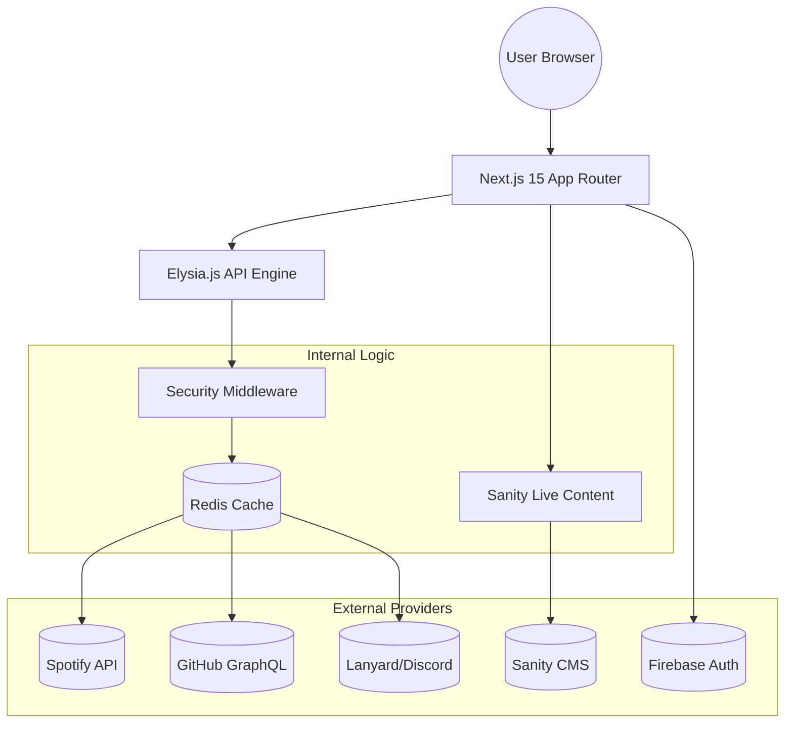

<!--
  Generated by AI-Powered README Generator
  Repository: https://github.com/WomB0ComB0/portfolio
  Generated: 2026-01-03T05:32:25.033Z
  Format: md
  Style: comprehensive
-->

# 🚀 WomB0ComB0 Portfolio

### A high-performance, real-time digital canvas showcasing technical mastery and developer identity.


---

## 🗺️ Table of Contents

- [✨ Overview & Introduction](#-overview--introduction)
- [🌟 Feature Highlights](#-feature-highlights)
- [🏛️ Architecture & Design](#️-architecture--design)
- [🛠️ Getting Started](#️-getting-started)
- [💡 Usage & Workflows](#-usage--workflows)
- [🛡️ Security & Performance](#️-security--performance)
- [⚠️ Limitations & Roadmap](#️-limitations--roadmap)
- [🤝 Contributing](#-contributing)
- [📜 License & Credits](#-license--credits)
- [📚 Appendix](#-appendix)

---

## ✨ Overview & Introduction <a name="overview"></a>

This repository contains the source code for a **modern, full-stack developer portfolio**. Built with the **Next.js 15 App Router** and powered by a high-performance **Elysia.js** API backend, it bridges the gap between a static resume and a dynamic real-time dashboard.

### Why It Matters
Modern developers are defined by more than just a static list of skills. This platform aggregates:
- **Professional Identity:** Projects, certifications, and experience managed via Sanity CMS.
- **Real-time Activity:** Live Spotify "Now Playing", Discord presence, and Wakatime coding metrics.
- **Social Proof:** A Firebase-powered Guestbook and dynamic GitHub contribution statistics.

### Target Audience
- **Hiring Managers** seeking deep technical insights and verifiable activity.
- **Developers** looking for a high-end boilerplate featuring Next.js 15 + Elysia.
- **Open Source Enthusiasts** interested in API orchestration patterns.

[⬆️ Back to Top](#-womb0comb0-portfolio)

---

## 🌟 Feature Highlights <a name="features"></a>

### 🎨 Frontend & Experience
*   **Command Palette (KBar):** Global navigation and quick actions via `Cmd+K`.
*   **Visual Excellence:** Utilizes **MagicUI** (BlurFade, BorderBeam) and **Framer Motion** for smooth, layout-aware transitions.
*   **Glassmorphism & Theming:** Deeply integrated Dark Mode with custom shader backgrounds.
*   **PWA Ready:** Fully offline-capable with a custom manifest and service worker configuration.

### ⚙️ Backend & Logic
*   **Elysia.js Integration:** Blazing fast API routes running alongside Next.js using Bun for high-throughput data fetching.
*   **Sanity.io CMS:** Content is decoupled from code, allowing for real-time updates to projects and resumes without redeployment.
*   **Intelligent Caching:** Custom SWR (Stale-While-Revalidate) logic and Redis integration to bypass external API rate limits.

### 📊 Live Integrations
*   **Spotify:** Real-time playback status, top tracks, and artist rankings.
*   **Lanyard:** Live Discord status tracking (Online/Idle/DND) and activity monitoring.
*   **GitHub:** Dynamic repository pinning and real-time contribution graphing.
*   **n8n Workflows:** Automated content synchronization bots.

> [!TIP]
> Use the **Command Palette** (`Ctrl/Cmd + K`) to quickly jump between the Guestbook, Projects, and Stats pages!

[⬆️ Back to Top](#-womb0comb0-portfolio)

---

## 🏛️ Architecture & Design <a name="architecture"></a>

The project follows a **Modular Monolith** pattern. While Next.js handles the UI and SSR, a specialized internal API layer (Elysia) handles external data orchestration.

### System Data Flow



### Technology Stack breakdown
| Layer | Technology | Responsibility |
| :--- | :--- | :--- |
| **Runtime** | Bun | Blazing fast execution, package management, and testing. |
| **Framework** | Next.js 15 | React Server Components (RSC) and App Router. |
| **API Engine** | Elysia.js | High-performance Type-safe API endpoints (`/api/v1`). |
| **CMS** | Sanity.io | Headless content management for structured data. |
| **Database** | Redis / Firebase | Caching layer and Real-time Guestbook persistence. |
| **Styling** | Tailwind CSS | Utility-first design with complex animations. |

[⬆️ Back to Top](#-womb0comb0-portfolio)

---

## 🛠️ Getting Started <a name="getting-started"></a>

### Prerequisites
- **Bun** (Recommended) or Node.js 20+
- **Docker** (Optional, for containerized deployment)
- **Sanity.io Account** for the content studio
- **Firebase Project** for Guestbook functionality

### Installation

1. **Clone the repository**
   ```bash
   git clone https://github.com/WomB0ComB0/portfolio.git
   cd portfolio
   ```

2. **Install Dependencies**
   ```bash
   bun install
   ```

3. **Environment Setup**
   Copy the example environment file and fill in your secrets:
   ```bash
   cp .env.example .env.local
   ```

### Configuration Callouts
> [!IMPORTANT]
> You must configure the following keys in `.env.local` or the app will fail to fetch core content:
> - `NEXT_PUBLIC_SANITY_PROJECT_ID`
> - `GITHUB_TOKEN` (Personal Access Token)
> - `SPOTIFY_CLIENT_ID` & `SPOTIFY_CLIENT_SECRET`

<details>
<summary><b>View All Environment Variables</b></summary>

| Variable | Usage |
| :--- | :--- |
| `REDIS_URL` | Connection for Upstash or local Redis. |
| `NEXT_PUBLIC_FIREBASE_CONFIG` | Stringified JSON of your Firebase client config. |
| `SANITY_API_READ_TOKEN` | Token for fetching private content from Sanity. |
| `WAKATIME_API_KEY` | To display coding activity stats. |
</details>

### Running the App

**Development Mode:**
```bash
bun dev
```

**Production Build:**
```bash
bun run build
bun start
```

[⬆️ Back to Top](#-womb0comb0-portfolio)

---

## 💡 Usage & Workflows <a name="usage"></a>

### Managing Content
Content is decoupled via Sanity. To edit your resume or projects without code changes:
1. Run the Sanity Studio locally: `bun sanity start` (or use the deployed studio).
2. Edit "Projects", "Experience", or "Certifications".
3. The Next.js frontend uses **Sanity Live Content** to reflect changes instantly.

### Command Palette Workflows
- **`Cmd + K`**: Open the menu.
- **Search**: Start typing to filter routes or search blog posts.
- **Theme**: Toggle between light and dark modes instantly.

### Maintenance Scripts
The project includes a robust set of maintenance utilities in the `scripts/` directory:
- `bun run scripts/cleanup.ts`: Removes unused assets and temp files.
- `bun run scripts/audit.ts`: Runs security audits on dependencies.
- `bun run scripts/package-cost.ts`: Analyzes bundle size impacts of new packages.

[⬆️ Back to Top](#-womb0comb0-portfolio)

---

## 🛡️ Security & Performance <a name="security"></a>

### Performance Metrics
- **Lighthouse Score:** Aiming for 95+ in all categories.
- **Runtime:** Powered by Bun for < 10ms API response times.
- **Image Optimization:** Automated WebP conversion and CDN delivery via Sanity.

### Security Implementation
🔍 **Proactive Defense:**
- **CIDR-based Banning:** Located in `src/lib/security/banlist-cidr.ts` to block malicious IP ranges.
- **CSRF Protection:** Integrated middleware for all mutation-heavy API routes.
- **Rate Limiting:** Redis-backed sliding window rate limiter to prevent API abuse.
- **XSS Sanitization:** Custom filters for Guestbook entries to prevent script injection.

[⬆️ Back to Top](#-womb0comb0-portfolio)

---

## ⚠️ Limitations & Roadmap <a name="roadmap"></a>

### Current Limitations
- **Cold Starts:** If using serverless Redis (Upstash), initial API calls may have 100-200ms latency.
- **Guestbook Moderation:** Requires manual deletion in the Firebase console for now.

### 🚀 Future Roadmap
- [ ] **AI Chatbot:** Integrate a "Digital Twin" using Gemini/GPT to answer questions about my resume.
- [ ] **Internationalization:** Multi-language support (i18n) for global reach.
- [ ] **Advanced Analytics:** Custom dashboard for page-specific web vitals.
- [ ] **N8N Automation:** Expanded workflows for auto-sharing blog posts to LinkedIn/Twitter.

[⬆️ Back to Top](#-womb0comb0-portfolio)

---

## 🤝 Contributing <a name="contributing"></a>

Contributions are what make the open-source community such an amazing place to learn, inspire, and create.

1. **Fork the Project**
2. **Create your Feature Branch** (`git checkout -b feat/AmazingFeature`)
3. **Commit your Changes** (`git commit -m 'feat: Add some AmazingFeature'`)
4. **Push to the Branch** (`git push origin feat/AmazingFeature`)
5. **Open a Pull Request**

✅ **Code Style:** This project uses **Biome** for linting and formatting. Ensure you run `bun run lint` before committing.

[⬆️ Back to Top](#-womb0comb0-portfolio)

---

## 📜 License & Credits <a name="license"></a>

- **License:** Distributed under the MIT License. See `LICENSE` for more information.
- **Maintainer:** [WomB0ComB0](https://github.com/WomB0ComB0)
- **Acknowledgments:**
    - [MagicUI](https://magicui.design/) for the stunning UI components.
    - [ElysiaJS](https://elysiajs.com/) for the blazing fast API layer.
    - [Sanity.io](https://www.sanity.io/) for the best-in-class CMS experience.

---

## 📚 Appendix <a name="appendix"></a>

### FAQ
**Q: Why use Elysia.js inside Next.js?**
A: Elysia provides superior type safety and performance for heavy data processing and third-party API orchestration that Next.js standard API routes sometimes struggle to handle efficiently at scale.

**Q: Can I use this for my own portfolio?**
A: Absolutely! Follow the [Getting Started](#-getting-started) guide, but ensure you replace the Sanity and Firebase credentials with your own.

### Troubleshooting
| Issue | Solution |
| :--- | :--- |
| **Sanity CORS Error** | Ensure your local domain (`localhost:3000`) is added to the Sanity Project Settings. |
| **Spotify Not Updating** | Check if your Refresh Token has expired or if your App is still in "Development Mode" in the Spotify Dashboard. |
| **PWA Not Installing** | PWAs require HTTPS. Use a tunnel like `ngrok` or deploy to Vercel/Netlify for testing. |

[⬆️ Back to Top](#-womb0comb0-portfolio)