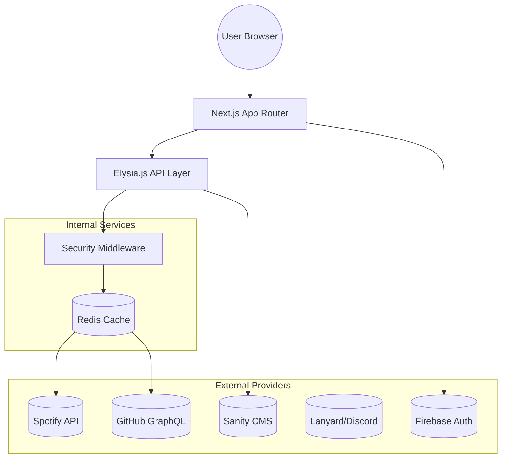

<!--
  Generated by AI-Powered README Generator
  Repository: https://github.com/WomB0ComB0/portfolio
  Generated: 2026-01-03T05:30:49.413Z
  Format: md
  Style: comprehensive
-->

# 🚀 WomB0ComB0 Portfolio

### An interactive, high-performance digital canvas showcasing developer identity, real-time insights, and technical mastery.


---

## 🗺️ Table of Contents

- [✨ Overview & Introduction](#-overview--introduction)
- [🌟 Feature Highlights](#-feature-highlights)
- [🏛️ Architecture & Design](#️-architecture--design)
- [🛠️ Getting Started](#️-getting-started)
- [💡 Usage & Workflows](#-usage--workflows)
- [⚠️ Limitations & Roadmap](#️-limitations--roadmap)
- [🤝 Contributing](#-contributing)
- [📜 License & Credits](#-license--credits)
- [📚 Appendix](#-appendix)

---

## ✨ Overview & Introduction <a name="overview"></a>

This application is a **comprehensive developer ecosystem** disguised as a portfolio. Built with the **Next.js 15 App Router** and powered by a high-performance **Elysia.js** API backend, it bridges the gap between static resume sites and dynamic real-time dashboards.

### Why It Matters
Modern developers are more than just a list of skills; they are an active stream of contributions, music, coding habits, and thoughts. This portfolio aggregates:
- **Professional History:** Projects, certifications, and experience managed via Sanity CMS.
- **Real-time Activity:** Live Spotify "Now Playing", Discord status, and Wakatime metrics.
- **Community Interaction:** A Firebase-powered Guestbook for social proof.

### Target Audience
- **Hiring Managers** seeking deep technical insights.
- **Fellow Developers** looking for a boilerplate of high-end Next.js architecture.
- **Open Source Enthusiasts** interested in API integration patterns (Lanyard, Wakatime, Spotify).

[[⬆️ Back to Top](#-table-of-contents)]

---

## 🌟 Feature Highlights <a name="features"></a>

### 🎨 Frontend & UX
- **Command Palette:** Global navigation via `Cmd+K` (KBar) integration.
- **Visual Polish:** Utilizes MagicUI (BlurFade, BorderBeam) and Framer Motion for buttery-smooth transitions.
- **Dark Mode First:** Deeply integrated theme switching with CSS variables.
- **PWA Ready:** Fully configured manifest and service worker for "App-like" installation.

### ⚙️ Backend & API
- **Elysia.js Integration:** Blazing fast API routes running inside Next.js via Bun.
- **Sanity.io CMS:** Type-safe content management with Groq queries.
- **Redis Caching:** Intelligent SWR (Stale-While-Revalidate) caching for external API calls to avoid rate limits.
- **Robust Security:** Built-in CSRF protection, CIDR-based IP banning, and XSS sanitization.

### 📊 Integrations
- **Spotify:** Top tracks, artists, and live playback state.
- **GitHub:** Dynamic repository pinning and contribution stats.
- **Lanyard:** Real-time Discord presence tracking.
- **Firebase:** Secure authentication for the Guestbook.

[[⬆️ Back to Top](#-table-of-contents)]

---

## 🏛️ Architecture & Design <a name="architecture"></a>

The project follows a **Modular Monolith** approach. While Next.js handles the UI, a sub-application (Elysia) handles specialized API logic, allowing for high-performance data processing.

### System Data Flow



### Component Breakdown
| Layer | Technology | Responsibility |
| :--- | :--- | :--- |
| **Runtime** | Bun | Fast execution and package management. |
| **Framework** | Next.js 15 | SSR/ISR rendering and routing. |
| **API Engine** | Elysia.js | High-throughput endpoints (v1). |
| **Database/CMS** | Sanity.io | Structured content (Projects/Exp). |
| **Auth** | Firebase | Guestbook identity management. |
| **Styling** | Tailwind CSS | Utility-first responsive design. |

[[⬆️ Back to Top](#-table-of-contents)]

---

## 🛠️ Getting Started <a name="getting-started"></a>

### Prerequisites
- **Bun** (Recommended) or Node.js 20+
- **Docker** (Optional, for containerized deployment)
- **Sanity.io Account** for content management
- **Firebase Project** for Guestbook functionality

### Installation Steps

1. **Clone the repository**
   ```bash
   git clone https://github.com/WomB0ComB0/portfolio.git
   cd portfolio
   ```

2. **Install Dependencies**
   ```bash
   bun install
   ```

3. **Environment Setup**
   Copy the example environment file and fill in your keys:
   ```bash
   cp .env.example .env.local
   ```

### Configuration Callouts
> [!IMPORTANT]
> You must set `NEXT_PUBLIC_SANITY_PROJECT_ID` and `NEXT_PUBLIC_SANITY_DATASET` for the site to render content.

<details>
<summary><b>View Required Environment Variables</b></summary>

| Variable | Description |
| :--- | :--- |
| `SPOTIFY_CLIENT_ID` | Your Spotify Dev Application ID |
| `SPOTIFY_CLIENT_SECRET` | Your Spotify Dev Application Secret |
| `GITHUB_TOKEN` | Personal Access Token for GitHub API |
| `NEXT_PUBLIC_FIREBASE_CONFIG` | JSON string of Firebase client config |
| `REDIS_URL` | Connection string for Upstash or local Redis |
</details>

### Running Development
```bash
bun dev
```
Navigate to `http://localhost:3000` to see the magic.

[[⬆️ Back to Top](#-table-of-contents)]

---

## 💡 Usage & Workflows <a name="usage"></a>

### Managing Content
Content is managed through the **Sanity Studio**. You can run it locally:
```bash
bun sanity start
```
This allows you to edit Projects, Experiences, and Certifications without redeploying code.

### Command Palette (KBar)
The application includes a global search/command interface. 
- **Trigger:** `Cmd + K` or `Ctrl + K`
- **Actions:** Navigate to pages, toggle theme, search blog posts.

### Security Workflows
The application includes a custom security layer located in `src/lib/security`.
- **Ban List:** Add IPs to `banlist.ts` to block malicious actors.
- **Rate Limiting:** Managed via Redis to prevent API abuse.

[[⬆️ Back to Top](#-table-of-contents)]

---

## ⚠️ Limitations & Roadmap <a name="roadmap"></a>

### Current Limitations
- **Guestbook Moderation:** Currently requires manual deletion in Firebase Console.
- **Image Hosting:** Heavily reliant on Sanity CDN; requires proper API setup for images.
- **Cold Starts:** If using serverless Redis, the first load might experience 200ms latency.

### 🚀 Future Roadmap
- [ ] **AI Chatbot:** Integrate a Gemini/GPT-powered "Digital Twin" to answer resume questions.
- [ ] **Localized Content:** Multi-language support (i18n).
- [ ] **Advanced Analytics:** Custom dashboard for page-specific web vitals.
- [ ] **Newsletter:** Integration with Mailchimp or Beehiiv.

[[⬆️ Back to Top](#-table-of-contents)]

---

## 🤝 Contributing <a name="contributing"></a>

We welcome contributions! Please follow these steps:

1. **Branching:** Use `feat/` for new features and `fix/` for bug fixes.
2. **Linting:** Ensure your code passes Biome/Lint checks.
   ```bash
   bun run lint
   ```
3. **Testing:** Run Vitest and Playwright tests before submitting.
   ```bash
   bun test
   bun run test:e2e
   ```

> [!TIP]
> Use the provided `Makefile` for common tasks like `make build` or `make clean`.

[[⬆️ Back to Top](#-table-of-contents)]

---

## 📜 License & Credits <a name="license"></a>

### License
This project is licensed under the **MIT License**. See [LICENSE](LICENSE) for details.

### Acknowledgments
- **UI Components:** [shadcn/ui](https://ui.shadcn.com) & [MagicUI](https://magicui.design).
- **Icons:** [Lucide React](https://lucide.dev).
- **Animations:** [Framer Motion](https://framer.com/motion).
- **Presence API:** [Lanyard](https://github.com/Phineas/lanyard).

[[⬆️ Back to Top](#-table-of-contents)]

---

## 📚 Appendix <a name="appendix"></a>

### FAQ
**Q: Why use Elysia.js inside Next.js?**  
A: Next.js API routes are great, but Elysia provides better type safety (via Eden) and significantly higher performance for data-intensive processing.

**Q: Can I run this on Vercel?**  
A: Yes, it is fully optimized for Vercel deployment, including edge runtime support for specific routes.

### Troubleshooting
| Issue | Solution |
| :--- | :--- |
| **Sanity 404** | Check your `projectId` and ensure the dataset is set to `public`. |
| **Spotify not updating** | Ensure your Refresh Token hasn't expired and Redis is connected. |
| **Hydration Errors** | Usually caused by browser extensions or Lanyard status updates on mount. |

---
**Maintained by [WomB0ComB0](https://github.com/WomB0ComB0)**